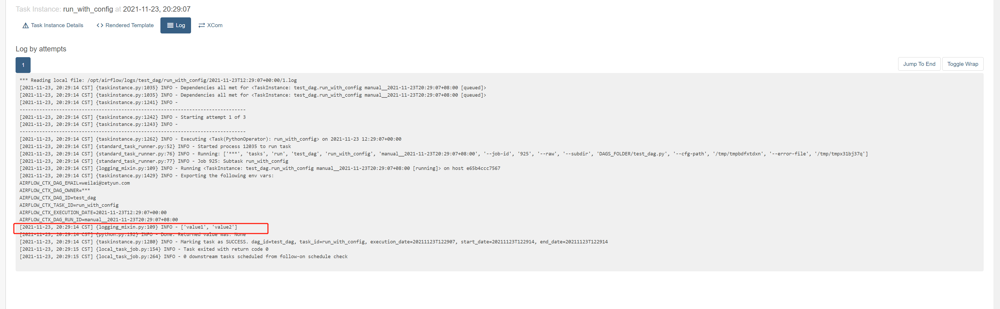
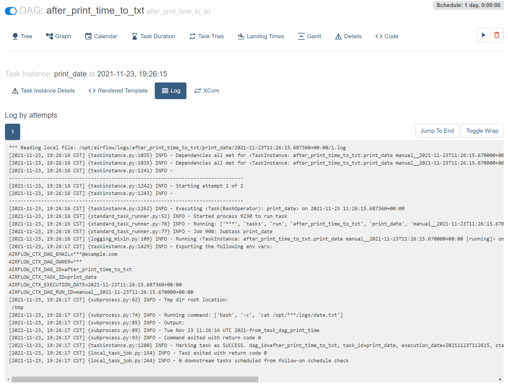

## 创建简单 DAG 文件
### DAG 文件示例
可以在主页查看到很多 DAG 示例文件，进入对应 DAG code 页面，可以看到对应的代码

当前编写一个简单的 DAG 文件， test_dag.py
```python
# [START import_module]
from datetime import datetime, timedelta
from textwrap import dedent
import os 
import time


# The DAG object; we'll need this to instantiate a DAG
from airflow import DAG

# Operators; we need this to operate!

from airflow.operators.python import PythonOperator  # 使用 PythonOperator

from airflow.models import Variable

from airflow.providers.postgres.operators.postgres import PostgresOperator
import psycopg2

from airflow.operators.email import EmailOperator


from airflow.providers.http.operators.http import SimpleHttpOperator
from airflow.providers.http.sensors.http import HttpSensor


import json

from airflow.operators.trigger_dagrun import TriggerDagRunOperator
# [END import_module]

# [START default_args]
# These args will get passed on to each operator
# You can override them on a per-task basis during operator initialization
default_args = {
    'owner': 'airflow',
    'depends_on_past': False,
    'email': ['weilai@zetyun.com'],
    'email_on_failure': True,   # 设置邮件失败也会发送
    'email_on_retry': True,     # 设置邮件重试也会发送 
    'retries': 2,               # 重试次数
    'retry_delay': timedelta(minutes=5),  # 重试间隔
    # 'queue': 'bash_queue',
    # 'pool': 'backfill',
    # 'priority_weight': 10,
    # 'end_date': datetime(2016, 1, 1),
    # 'wait_for_downstream': False,
    # 'dag': dag,
    # 'sla': timedelta(hours=2),
    # 'execution_timeout': timedelta(seconds=300),
    # 'on_failure_callback': some_function,
    # 'on_success_callback': some_other_function,
    # 'on_retry_callback': another_function,
    # 'sla_miss_callback': yet_another_function,
    # 'trigger_rule': 'all_success'
}
# [END default_args]

def sum100():
    sum = 0
    for i in range(100):
        sum += i
    print(sum)
    return sum  # 测试 xcom 跨任务通信

# 获取 sum_1_100 的值，测试 xcom 跨任务通信
def get_sum100(**context):
    sum_value = context['ti'].xcom_pull(dag_id='test_dag',task_ids='sum_1_100',key= "return_value")
    #sum_value =  context['ti'].xcom_pull(task_ids='sum_1_100', key= "return_value")
    print(sum_value)
    print('1+2+...+101=',sum_value+101)


def use_variable():
    # 需要在网页上配置 variable,以及导入包
    variable_1 = Variable.get("key1")
    variable_2 = Variable.get("key2_json", deserialize_json = True)
    print(variable_1)
    print(variable_2)

def run_with_config(**context): 
    config_value = context["dag_run"].conf.get("key")
    value = 'not found config_value'
    if config_value:
        value = config_value
    print(value)

def run_failed():
    print('this task will fail')
    print(1/0)    


def use_pg_insert():
    # 通过 hook 获取 connection 中保存的信息
    from airflow.hooks.base_hook import BaseHook
    conn = BaseHook.get_connection('airflow_pg')
    print(conn)
  
    pgdb = psycopg2.connect(
    host=conn.host,
    user=conn.login,
    password=conn.password,
    database=conn.schema,
    port=conn.port
    )
    pgcursor = pgdb.cursor()
    now_1 = datetime.now()
    str_now_1 = now_1.strftime('%Y%m%d-%H%M%S')
    now_2 = datetime.now()
    str_now_2 = now_2.strftime('%Y%m%d-%H%M%S')
    now_times_list = [str_now_1, str_now_2]
    for now_time_str in now_times_list: 
        sql = f"""
        INSERT INTO  test(str_time) VALUES ('{now_time_str}')
          """
        print(sql)
        pgcursor.execute(sql)
    pgdb.commit()

    print(pgcursor.rowcount, "record inserted.")
    pgdb.close()
 
def check(response):
    if response == 200:
        print("Returning True")
        return True
    else:
        print("Returning False")
        return False

def sleep_60s():
    print('sleep 60s')
    time.sleep(60)
    print('sleep 60s finished')
      
def sleep_30s():
    print('sleep 30s')
    time.sleep(30)
    print('sleep 30s finished')
 
#  测试此 task 运行完后，然后另一个 DAG 运行
def print_time_to_txt():
    print('hello world')
    os.system("echo $(date)-from_task_dag_print_time > /opt/airflow/logs/date.txt")

# [START instantiate_dag]
with DAG(
    'test_dag',   # DAG 的名字
    default_args=default_args,  # 使用的上面定义的基本变量
    description='简单 DAG 示例',  # DAG 的描述信息
    schedule_interval='30 20 * * *',  # 每天 20:30 运行一次
    start_date=datetime(2021, 11, 15),  # 开始时间
    catchup=False,  # 关闭补跑
    max_active_runs = 1, # 同时只能进行 1个 任务执行
    tags=['example'],  # 标签
) as dag:
    # [END instantiate_dag]

    # t1, t2 and t3 are examples of tasks created by instantiating operators
    # [START basic_task]

    dag.doc_md = """
    This is a documentation placed anywhere
    """  # otherwise, type it like this

    # [END basic_task]

    # 需要引入 PythonOperator
    sum100_task = PythonOperator(
        task_id = "sum_1_100",
        python_callable = sum100
	)

    get_sum_100 = PythonOperator(
        task_id = "get_sum_100",
        python_callable = get_sum100
        )

    print_time_to_text_task = PythonOperator(
        task_id = "print_time_to_txt",
        python_callable = print_time_to_txt
        )
    use_variable = PythonOperator(
        task_id = "use_variable",
        python_callable = use_variable
        )
    run_with_config = PythonOperator(
        task_id = "run_with_config",
        python_callable = run_with_config
        )
    # 测试重试次数和间隔
    run_failed = PythonOperator(
        task_id = "run_failed",
        python_callable = run_failed
        )

    use_pg_insert_task =PythonOperator(
        task_id='use_pg_insert',
        python_callable=use_pg_insert,
        ) 
     # 需要引入 PostgresOperator ，并且在网页中 admin/connections 中配置好连接信息
    pgsql_file_task = PostgresOperator(
        task_id='pgsql_file_task',
        postgres_conn_id='airflow_pg',
        sql='test_update_id1.sql', # ./dag 目录下
        dag=dag,
        )

    # 需要引入EmailOperator ，并且正确配置邮件信息
    email_task = EmailOperator(
        task_id = "send_email",
        to='weilai@zetyun.com',
        subject='DAG TEST - {{ds}}',   # 测试   jinja_templated
        html_content="""
             <h3>Email Test</h3> {{ ds_nodash }}<br/>{{ dag }}<br/>{{ conf }}<br/>{{ next_ds }}<br/>{{ yesterday_ds }}<br/>{{ tomorrow_ds }}<br/>{{ execution_date }}<br/>
        """,
        dag=dag
        )

    # 使用 HttpSensor 和 SimpleHttpOperator 测试 sensor 功能以及 provider
    task_http_sensor_check = HttpSensor(
        task_id='checkuser_from_httpsensor',
        http_conn_id='http_default',
        method='GET',
        endpoint='api/v1/users/httpsensor',
        response_check=lambda response: True if check(response.status_code) is True else False,
        poke_interval=5,
        dag=dag,
    
    )
    task_sleep_60s =PythonOperator(
        task_id='task_sleep_60s',
        python_callable=sleep_60s,
        )

    task_sleep_30s =PythonOperator(
        task_id='task_sleep_30s',
        python_callable=sleep_30s,
        )

    task_adduser_from_api = SimpleHttpOperator(
        task_id='adduser_from_api',
        method='POST',
        endpoint='api/v1/users',
        data = json.dumps(
        {
            "email": "httpsensor@zetyun.com",
            "first_name": "httpsensor",
            "last_name": "httpsensor",
            "roles": [
                 {
                 "name": "Public"
                 }
            ],
            "username": "httpsensor",
            "password": "httpsensor"
        }
        ),
        headers={"Content-Type": "application/json"},
        dag=dag,
        )

    task_deluser_from_api = SimpleHttpOperator(
        task_id='deluser_from_api',
        method='DELETE',
        endpoint='api/v1/users/httpsensor',
        headers={"Content-Type": "application/x-www-form-urlencoded"},
        dag=dag,
        )
    

    # 测试通知 下一个 DAG 运行   
    trigger_next_dag = TriggerDagRunOperator(
        trigger_dag_id = "after_print_time_to_txt",
        task_id = "get_time_txt_from_test_dag",
        wait_for_completion =False  # 只通知运行，不等待运行结果
    )

    sum100_task >> get_sum_100 >> email_task  # 任务 sum100_task 执行完后执行 get_sum_100

    use_pg_insert_task >> pgsql_file_task >> email_task
    task_sleep_60s >> task_adduser_from_api >>task_sleep_30s  >>  task_deluser_from_api

    print_time_to_text_task >> trigger_next_dag
# [END tutorial]


```

#### 详细信息

正常情况下，一个 DAG 最好只运行一组相关的任务。此 DAG 仅作测试 

#####  导入的包和基本变量

一般最好写在 任务导入的地方, 此处先把所有的 导入的包展示

```python
# [START import_module]
from datetime import datetime, timedelta
from textwrap import dedent

import os 
import time


# The DAG object; we'll need this to instantiate a DAG
from airflow import DAG

# Operators; we need this to operate!

from airflow.operators.python import PythonOperator  # 使用 PythonOperator

from airflow.models import Variable

from airflow.hooks.base_hook import BaseHook
from airflow.providers.postgres.operators.postgres import PostgresOperator
import psycopg2

from airflow.operators.email import EmailOperator


from airflow.providers.http.operators.http import SimpleHttpOperator
from airflow.providers.http.sensors.http import HttpSensor

import json

from airflow.operators.trigger_dagrun import TriggerDagRunOperator

default_args = {
    'owner': 'airflow',
    'depends_on_past': False,
    'email': ['weilai@zetyun.com'],
    'email_on_failure': True,   # 设置邮件失败也会发送
    'email_on_retry': True,     # 设置邮件重试也会发送 
    'retries': 2,               # 重试次数
    'retry_delay': timedelta(minutes=5),  # 重试间隔
    # 'queue': 'bash_queue',
    # 'pool': 'backfill',
    # 'priority_weight': 10,
    # 'end_date': datetime(2016, 1, 1),
    # 'wait_for_downstream': False,
    # 'dag': dag,
    # 'sla': timedelta(hours=2),
    # 'execution_timeout': timedelta(seconds=300),
    # 'on_failure_callback': some_function,
    # 'on_success_callback': some_other_function,
    # 'on_retry_callback': another_function,
    # 'sla_miss_callback': yet_another_function,
    # 'trigger_rule': 'all_success'
}
# [END default_args]

```


##### 测试 xcom 跨任务通信

一个任务的值，另一个任务可以获取

```python
def sum100():
    sum = 0
    for i in range(100):
        sum += i
    print(sum)
    return sum  # 测试 xcom 跨任务通信

# 获取 sum_1_100 的值，测试 xcom 跨任务通信
def get_sum100(**context):
    sum_value = context['ti'].xcom_pull(dag_id='test_dag',task_ids='sum_1_100',key= "return_value")
    #sum_value =  context['ti'].xcom_pull(task_ids='sum_1_100', key= "return_value")
    print(sum_value)
    print('1+2+...+101=',sum_value+101)
```

查看日志，有获取到值


查看页面，也有显示


##### 测试全局变量

```python

def use_variable():
    # 需要在网页上配置 variable,以及导入包
    
	from airflow.models import Variable
    variable_1 = Variable.get("key1")
    variable_2 = Variable.get("key2_json", deserialize_json = True)
    print(variable_1)
    print(variable_2)
```

定义的 variable 页面


查看日志，有获取到值


##### 测试运行任务时传参

```python
def run_with_config(**context): 
    config_value = context["dag_run"].conf.get("key")
    value = 'not found config_value'
    if config_value:
        value = config_value
    print(value)
```

未传入参数时


传入的参数


获取到传入的值



##### 测试失败的任务

主要测试 retry 次数

```python
def run_failed():
    print('this task will fail')
    print(1/0)    
    
```

根据定义重试了2次，


##### 测试获取connections 信息

```python
def use_pg_insert():
    # 通过 hook 获取 connection 中保存的信息
    from airflow.hooks.base_hook import BaseHook
    conn = BaseHook.get_connection('airflow_pg')
    print(conn)
  
    pgdb = psycopg2.connect(
    host=conn.host,
    user=conn.login,
    password=conn.password,
    database=conn.schema,
    port=conn.port
    )
    pgcursor = pgdb.cursor()
    now_1 = datetime.now()
    str_now_1 = now_1.strftime('%Y%m%d-%H%M%S')
    now_2 = datetime.now()
    str_now_2 = now_2.strftime('%Y%m%d-%H%M%S')
    now_times_list = [str_now_1, str_now_2]
    for now_time_str in now_times_list: 
        sql = f"""
        INSERT INTO  test(str_time) VALUES ('{now_time_str}')
          """
        print(sql)
        pgcursor.execute(sql)
    pgdb.commit()

    print(pgcursor.rowcount, "record inserted.")
    pgdb.close()
```


获取 连接信息


查看已插入信息


同时可以看到 id=1  的值 被修改

##### 测试 PostgresOperator 

```python
# 需要引入 PostgresOperator ，并且在网页中 admin/connections 中配置好连接信息
    from airflow.providers.postgres.operators.postgres import PostgresOperator   
    pgsql_file_task = PostgresOperator(
        task_id='pgsql_file_task',
        postgres_conn_id='airflow_pg',
        sql='test_update_id1.sql', # ./dag 目录下
        dag=dag,
        )

```

test_update_id1.sql 路径在 ./dag 下

```sql
update test set str_time = now() where id = 1
```


id = 1 的值已被修改


##### 测试发送邮件，以及templating-with-jinja

```python
    # 需要引入EmailOperator ，并且正确配置邮件信息
    from airflow.operators.email import EmailOperator
    email_task = EmailOperator(
        task_id = "send_email",
        to='weilai@zetyun.com',
        subject='DAG TEST - {{ds}}',   # 测试   jinja_templated
        html_content="""
             <h3>Email Test</h3> {{ ds_nodash }}<br/>{{ dag }}<br/>{{ conf }}<br/>{{ next_ds }}<br/>{{ yesterday_ds }}<br/>{{ tomorrow_ds }}<br/>{{ execution_date }}<br/>
        """,
        dag=dag
        )
```

使用了 jinja_templated，详细可参考 https://airflow.apache.org/docs/apache-airflow/stable/tutorial.html#templating-with-jinja


定义的失败也发送邮件


##### 测试 sensor 功能以及 provider

使用 HttpSensor 和 SimpleHttpOperator 测试 sensor 功能以及 provider


`task_http_sensor_check` ： 每 5s 监控 是否有 `httpsensor` 用户信息

 60s 后，创建用户 `httpsensor` ，30s 后， 然后删除用户  `httpsensor` 

```python
from airflow.providers.http.operators.http import SimpleHttpOperator
from airflow.providers.http.sensors.http import HttpSensor

import json


def check(response):
    if response == 200:
        print("Returning True")
        return True
    else:
        print("Returning False")
        return False

def sleep_60s():
    print('sleep 60s')
    time.sleep(60)
    print('sleep 60s finished')
    
def sleep_30s():
    print('sleep 30s')
    time.sleep(30)
    print('sleep 30s finished')
......................
  
  # 使用 HttpSensor 和 SimpleHttpOperator 测试 sensor 功能以及 provider
    task_http_sensor_check = HttpSensor(
        task_id='checkuser_from_httpsensor',
        http_conn_id='http_default',
        method='GET',
        endpoint='api/v1/users/httpsensor',
        response_check=lambda response: True if check(response.status_code) is True else False,
        poke_interval=5,
        dag=dag,
    
    )
    task_sleep_60s =PythonOperator(
        task_id='task_sleep_60s',
        python_callable=sleep_60s,
        )
    task_sleep_30s =PythonOperator(
        task_id='task_sleep_30s',
        python_callable=sleep_30s,
        )
    task_adduser_from_api = SimpleHttpOperator(
        task_id='adduser_from_api',
        method='POST',
        endpoint='api/v1/users',
        data = json.dumps(
        {
            "email": "httpsensor@zetyun.com",
            "first_name": "httpsensor",
            "last_name": "httpsensor",
            "roles": [
                 {
                 "name": "Public"
                 }
            ],
            "username": "httpsensor",
            "password": "httpsensor"
        }
        ),
        headers={"Content-Type": "application/json"},
        dag=dag,
        )

    task_deluser_from_api = SimpleHttpOperator(
        task_id='deluser_from_api',
        method='DELETE',
        endpoint='api/v1/users/httpsensor',
        headers={"Content-Type": "application/x-www-form-urlencoded"},
        dag=dag,
        )
    
    # 60s 后，创建用户，30s后， 然后删除用户 
    task_sleep_60s >> task_adduser_from_api >> task_sleep_30s >> task_deluser_from_api
    
```

可以查看到每隔 5秒观察一次，直到成功


刚好这个时间点 创建用户 httpsensor


30s 后删除用户


#####   测试此 task 运行完后，然后通知另一个 DAG 运行

 此 task 运行完后，然后通知另一个 DAG 运行

```python
def print_time_to_txt():
    print('hello world')
    os.system("echo $(date)-from_task_dag_print_time > /opt/airflow/logs/date.txt")


'..................'


    from airflow.operators.trigger_dagrun import TriggerDagRunOperator
    trigger_next_dag = TriggerDagRunOperator(
        trigger_dag_id = "after_print_time_to_txt",
        task_id = "get_time_txt_from_test_dag",
        wait_for_completion =False  # 只通知运行，不等待运行结果
    )


```

其中 after_print_time_to_txt.py DAG 文件如下

```python
from datetime import datetime, timedelta
from textwrap import dedent

# The DAG object; we'll need this to instantiate a DAG
from airflow import DAG

# Operators; we need this to operate!
from airflow.operators.bash import BashOperator

# [END import_module]

# [START default_args]
# These args will get passed on to each operator
# You can override them on a per-task basis during operator initialization
default_args = {
    'owner': 'airflow',
    'depends_on_past': False,
    'email': ['airflow@example.com'],
    'email_on_failure': False,
    'email_on_retry': False,
    'retries': 1,
    'retry_delay': timedelta(minutes=5),
    # 'queue': 'bash_queue',
    # 'pool': 'backfill',
    # 'priority_weight': 10,
    # 'end_date': datetime(2016, 1, 1),
    # 'wait_for_downstream': False,
    # 'dag': dag,
    # 'sla': timedelta(hours=2),
    # 'execution_timeout': timedelta(seconds=300),
    # 'on_failure_callback': some_function,
    # 'on_success_callback': some_other_function,
    # 'on_retry_callback': another_function,
    # 'sla_miss_callback': yet_another_function,
    # 'trigger_rule': 'all_success'
}
# [END default_args]

# [START instantiate_dag]
with DAG(
    'after_print_time_to_txt',
    default_args=default_args,
    description='after_print_time_to_txt',
    schedule_interval=timedelta(days=1),
    start_date=datetime(2021, 1, 1),
    catchup=False,
    tags=['example'],
) as dag:
    # [END instantiate_dag]

    # t1, t2 and t3 are examples of tasks created by instantiating operators
    # [START basic_task]
    t1 = BashOperator(
        task_id='print_date',
        bash_command='cat /opt/airflow/logs/date.txt',
    )

    dag.doc_md = __doc__  # providing that you have a docstring at the beginning of the DAG
    dag.doc_md = """
    This is a documentation placed anywhere
    """  # otherwise, type it like this
    # [END documentation]
    t1
# [END tutorial]

```

通知下一个DAG时间


下一个DAG运行时间



##### 测试sensor, 观察到 test_dag 运行完后，再运行 watch_print_time_to_txt.py

`watch_print_time_to_txt.py` 内容如下 

```
from datetime import datetime, timedelta
from airflow import DAG
from airflow.operators.bash_operator import BashOperator
from airflow.utils.dates import days_ago
from airflow.sensors.external_task_sensor import ExternalTaskMarker, ExternalTaskSensor

default_args={
        "owner": "airflow",
        "start_date": datetime(2021,11, 19),
        }
with DAG(
dag_id="watch_print_time_to_txt",
default_args=default_args,
schedule_interval='35 20 * * *',
#concurrency=1,
#max_active_runs=1,
tags=['example1'],
 ) as child_dag:
# [START howto_operator_external_task_sensor]
     child_task1 = ExternalTaskSensor(
     task_id="watch_print_time_to_txt",
     external_dag_id="test_dag",
     external_task_id="print_time_to_text_task",
    # timeout=600,
    # allowed_states=['success'],
    # failed_states=['failed', 'skipped'],
     execution_delta=timedelta(minutes=5)   # 观察 5 分钟前
    # mode= "reschedule",
     )

 # [END howto_operator_external_task_sensor]
     t1 = BashOperator(
        task_id='print_date',
        bash_command='cat /opt/airflow/logs/date.txt',
        dag = child_dag
    )

child_task1 >> t1
```

不停观察务开始5分钟前的test_dag


##### 测试 Dynamic_DAG

一个 python 文件，生成多个 DAG 文件

```
from airflow import DAG
from airflow.operators.python import PythonOperator
from airflow.utils.dates import days_ago
from datetime import timedelta


def print_hello():
    print('hello')


def print_world():
    print('world')


default_args = {
    'owner' : 'airflow',
    'email': ['airflow@airflow.com'],
    'email_on_failure': True,
    'email_on_retry': True,
    'retries': 1,
    'retry_delay': timedelta(seconds=30),
}


def generate_dag(investment_type):
    with DAG(
        dag_id = f'print_{investment_type}_value',
        default_args=default_args,
        description=f'This DAG print {investment_type} value',
        schedule_interval='5 5 * * *',
        start_date=days_ago(2),
        tags=['example'],
        catchup=False,
        max_active_runs=1,
    ) as dag:
        print_hello_task = PythonOperator(
            task_id=f'print_{investment_type}_hello',
            python_callable=print_hello,
        )
        print_world_task = PythonOperator(
            task_id=f'print_{investment_type}_world',
            python_callable=print_world,
        )
        print_hello_task >> print_world_task
        return dag

investment_types= ['DAG_A', 'DAG_B', 'DAG_C', 'DAG_D']
for _type in investment_types:
    globals()["Dynamic_DAG"+_type] = generate_dag(_type)
```


可以的看到 生成了 多个 DAG


写完保存到 ./dag 文件夹下可以被定时扫描到，并且可在 code 界面上详细查看


