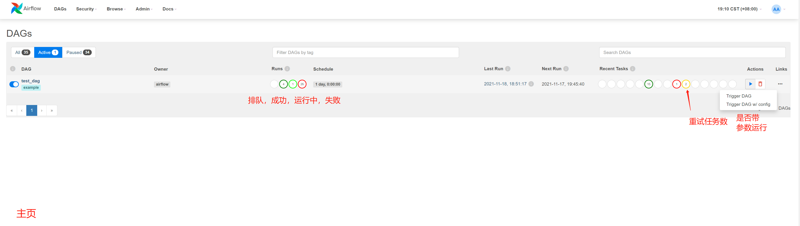

## airflow基本操作
###  ui

主页




任务详细


任务操作


用户权限信息


admin 操作


文档


### 终端

```bash
[root@k8s01 airflow]# cat ./airflow.sh
PROJECT_DIR="$(cd "$(dirname "${BASH_SOURCE[0]}")" && pwd)"

set -euo pipefail

export COMPOSE_FILE="${PROJECT_DIR}/docker-compose.yaml"
if [ $# -gt 0 ]; then
    exec docker-compose run --rm airflow-cli "${@}"
else
    exec docker-compose run --rm airflow-cli
fi
[root@k8s01 airflow]# ./airflow.sh python
Python 3.7.12 (default, Sep 28 2021, 20:11:10)
[GCC 8.3.0] on linux
Type "help", "copyright", "credits" or "license" for more information.
>>> import requests
>>> exit()
[root@k8s01 airflow]# ./airflow.sh bash
root@9b8e61f902f2:/opt/airflow# airflow -h   # 查看帮助命令
usage: airflow [-h] GROUP_OR_COMMAND ...

positional arguments:
  GROUP_OR_COMMAND

    Groups:
      celery         Celery components
      config         View configuration
      connections    Manage connections
      dags           Manage DAGs
      db             Database operations
      jobs           Manage jobs
      kubernetes     Tools to help run the KubernetesExecutor
      pools          Manage pools
      providers      Display providers
      roles          Manage roles
      tasks          Manage tasks
      users          Manage users
      variables      Manage variables

    Commands:
      cheat-sheet    Display cheat sheet
      info           Show information about current Airflow and environment
      kerberos       Start a kerberos ticket renewer
      plugins        Dump information about loaded plugins
      rotate-fernet-key
                     Rotate encrypted connection credentials and variables
      scheduler      Start a scheduler instance
      standalone     Run an all-in-one copy of Airflow
      sync-perm      Update permissions for existing roles and optionally DAGs
      triggerer      Start a triggerer instance
      version        Show the version
      webserver      Start a Airflow webserver instance

optional arguments:
  -h, --help         show this help message and exit

```
测试创建用户  create_user_by_command
```
root@9b8e61f902f2:/opt/airflow# airflow users create  -u create_user_by_command -e command@zetyun.com -f test_command_01 -l test_comand_02 -r Public 
[2021-11-19 13:16:34,384] {manager.py:512} WARNING - Refused to delete permission view, assoc with role exists DAG Runs.can_create User
Password:
Repeat for confirmation:
[2021-11-19 13:17:06,837] {manager.py:214} INFO - Added user create_user_by_command
User "create_user_by_command" created with role "Public"
```

### API

API 测试，详情可参考文档 


测试创建用户 create_user_by_api

```
root@9b8e61f902f2:/opt/airflow#  curl -X 'POST' \
   --user "airflow:airflow" \
  'http://192.168.100.101:8080/api/v1/users' \
  -H 'accept: application/json' \
  -H 'Content-Type: application/json' \
  -d '{
  "email": "api@zetyun.com ",
  "first_name": "api_01",
  "last_name": "api_02",
  "roles": [
    {
      "name": "Public"
    }
  ],
  "username": "create_user_by_api",
  "password": "create_user_by_api"
}'


# 返回
{
  "active": true,
  "changed_on": "2021-11-19T13:22:51.224966",
  "created_on": "2021-11-19T13:22:51.224953",
  "email": "api@zetyun.com ",
  "fail_login_count": null,
  "first_name": "api_01",
  "last_login": null,
  "last_name": "api_02",
  "login_count": null,
  "roles": [
    {
      "name": "Public"
    }
  ],
  "username": "create_user_by_api"
}


```
### 数据库
连接数据库，基本上能够看到表名字大概知道意思。

```
airflow=# \l
                               List of databases
   Name    |  Owner  | Encoding |  Collate   |   Ctype    |  Access privileges
-----------+---------+----------+------------+------------+---------------------
 airflow   | airflow | UTF8     | en_US.utf8 | en_US.utf8 |
 postgres  | airflow | UTF8     | en_US.utf8 | en_US.utf8 |
 template0 | airflow | UTF8     | en_US.utf8 | en_US.utf8 | =c/airflow         +
           |         |          |            |            | airflow=CTc/airflow
 template1 | airflow | UTF8     | en_US.utf8 | en_US.utf8 | =c/airflow         +
           |         |          |            |            | airflow=CTc/airflow
(4 rows)

airflow=# \c airflow
You are now connected to database "airflow" as user "airflow".
airflow-# \dt
                    List of relations
 Schema |             Name              | Type  |  Owner
--------+-------------------------------+-------+---------
 public | ab_permission                 | table | airflow
 public | ab_permission_view            | table | airflow
 public | ab_permission_view_role       | table | airflow
 public | ab_register_user              | table | airflow
 public | ab_role                       | table | airflow
 public | ab_user                       | table | airflow
 public | ab_user_role                  | table | airflow
 public | ab_view_menu                  | table | airflow
 public | alembic_version               | table | airflow
 public | celery_taskmeta               | table | airflow
 public | celery_tasksetmeta            | table | airflow
 public | connection                    | table | airflow
 public | dag                           | table | airflow
 public | dag_code                      | table | airflow
 public | dag_pickle                    | table | airflow
 public | dag_run                       | table | airflow
 public | dag_tag                       | table | airflow
 public | import_error                  | table | airflow
 public | job                           | table | airflow
 public | log                           | table | airflow
 public | rendered_task_instance_fields | table | airflow
 public | sensor_instance               | table | airflow
 public | serialized_dag                | table | airflow
 public | sla_miss                      | table | airflow
 public | slot_pool                     | table | airflow
 public | task_fail                     | table | airflow
 public | task_instance                 | table | airflow
 public | task_reschedule               | table | airflow
 public | test                          | table | airflow
 public | trigger                       | table | airflow
 public | variable                      | table | airflow
 public | xcom                          | table | airflow
(32 rows)
```


查看表格信息

```bash
airflow=# select * from ab_user;    # 可以看到之前用命令行和 API 创建的用户
 id |   first_name    |   last_name    |        username        |                                            password                                            | active |          email           |         last_login         | login_count | fail_login_count |         created_on
  |         changed_on         | created_by_fk | changed_by_fk
----+-----------------+----------------+------------------------+------------------------------------------------------------------------------------------------+--------+--------------------------+----------------------------+-------------+------------------+--------------------------
--+----------------------------+---------------+---------------
  1 | Airflow         | Admin          | airflow                | pbkdf2:sha256:150000$07379dOC$74441425bb59f7b6f566f747f40933529f1183d347fe54c313ac249f28df04a3 | t      | airflowadmin@example.com | 2021-11-19 13:23:40.846285 |         423 |                0 | 2021-11-17 11:44:55.23640
5 | 2021-11-17 11:44:55.236418 |               |


  5 | test_command_01 | test_comand_02 | create_user_by_command | pbkdf2:sha256:150000$90YTYnvD$e07f2672e4202de13362e5d9fbaf41fe12ff2eba2568febd3a666f34001b9a55 | t      | command@zetyun.com       |                            |             |                  | 2021-11-19 13:17:06.83418
7 | 2021-11-19 13:17:06.834205 |  |


  6 | api_01          | api_02         | create_user_by_api     | pbkdf2:sha256:150000$BT4pi1gG$a2271c26f02a9d120eaa0027d1d8b4ac27d0d95ba6bad5c86afb45f5454a1c88 | t      | api@zetyun.com           |                            |             |                  | 2021-11-19 13:22:51.22495
3 | 2021-11-19 13:22:51.224966 |             1 |             1
(3 rows)


airflow=# select * from connection;   # 保存的连接信息
 id |   conn_id    | conn_type |      host       | schema  |  login  | password | port  | extra | is_encrypted | is_extra_encrypted | description
----+--------------+-----------+-----------------+---------+---------+----------+-------+-------+--------------+--------------------+--------------
  1 | airflow_pg   | postgres  | 192.168.100.101 | airflow | airflow | airflow  | 54321 |       | f            | f                  | airflow_pg
  
  
  2 | http_default | http      | 192.168.100.101 |         | airflow | airflow  |  8080 |       | f            | f                  | http_default
(2 rows)
```